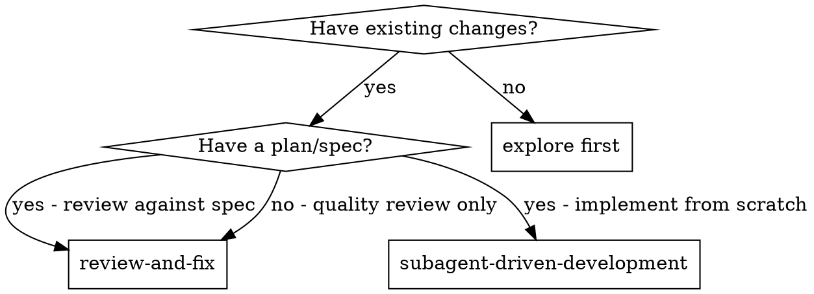
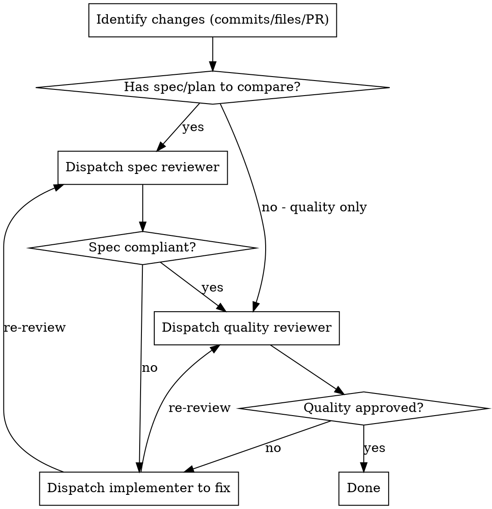

# Review and Fix

Review existing changes → identify issues → fix with subagent pattern.

Entry point when you have changes to review (vs implement which starts from a plan).

## When to Use



## Input

Accepts one of:
- Commit range: `main..HEAD`, `HEAD~3..HEAD`
- File list: `src/foo.ts src/bar.ts`
- PR number: `#123` (fetches via `gh pr view`)

## Process



## Steps

1. **Parse input** - determine commit range, files, or PR
2. **Gather context**:
   - `git diff {range}` or file contents
   - Find related spec/plan if exists (`.agents/plans/`, PR description, issue)
3. **Spec review** (if spec exists):
   - Use `subagent-driven-development/spec-reviewer-prompt.md`
4. **Quality review**:
   - Use `subagent-driven-development/code-quality-reviewer-prompt.md`
5. **Present summary** - table of issues by severity
6. **CRITICAL: Use AskUserQuestion** to determine next steps:
   ```
   AskUserQuestion:
     question: "How should I proceed with fixes?"
     header: "Fix scope"
     options:
       - label: "Critical only"
         description: "Fix {N} critical issues, leave rest"
       - label: "Critical + High"
         description: "Fix {N} critical and high priority issues"
       - label: "All issues"
         description: "Fix all {N} issues across all severities"
       - label: "Let me pick"
         description: "I'll specify which issues to fix"
   ```
7. **Dispatch fixes** based on answer - use implementer prompt per component/area
8. **Re-review** fixed code → loop until approved or user stops

## Implementer Fix Prompt

When reviewer finds issues, dispatch fix subagent:

```
Task tool (general-purpose):
  description: "Fix review issues"
  prompt: |
    The reviewer found these issues in the code:

    ## Issues to Fix

    {list of issues with file:line references}

    ## Context

    {what the code is supposed to do}

    ## Your Job

    1. Fix each issue listed
    2. Verify fixes work
    3. Commit with message: "fix: address review feedback"
    4. Report what you fixed

    Do NOT:
    - Fix things not listed (scope creep)
    - Refactor beyond what's needed
    - Add features
```

## Key Behaviors

- **After summary → AskUserQuestion** to determine fix scope
- **After user answers → dispatch fixes immediately**
- **After fixes → re-review automatically**

Keep momentum: summary → ask → fix → verify → done

## Integration

Uses prompts from **subagent-driven-development**:
- `spec-reviewer-prompt.md`
- `code-quality-reviewer-prompt.md`

Related skills:
- **pr-fix-comments** - fix PR review comments (from humans)
- **code-review** - general review guidance

## Escalate to Team Review

For security-sensitive changes, performance-critical paths, or changes touching 5+ files across subsystems → recommend: `use Skill tool to invoke team-review`
