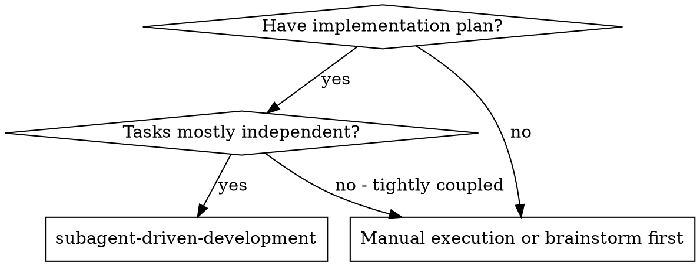
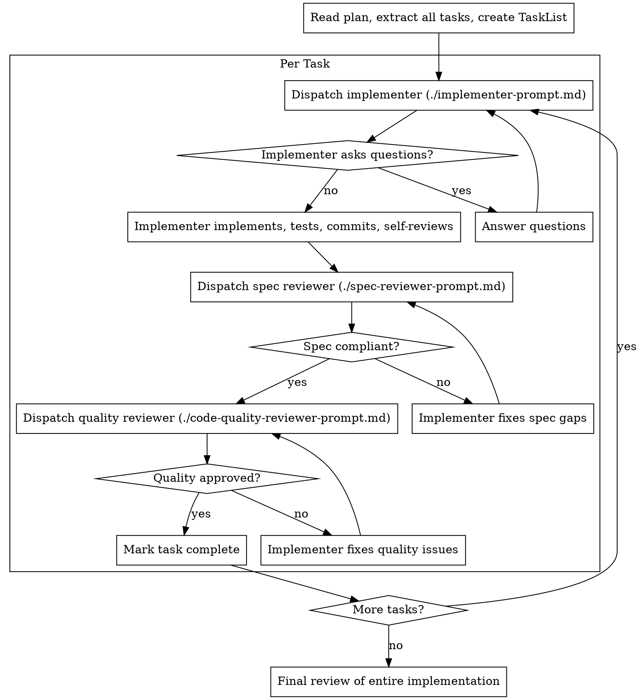

# Subagent-Driven Development

Fresh subagent per task + two-stage review = high quality, fast iteration.

## When to Use



## Process



## Key Principles

**Controller provides full context:**
- Don't make subagent read plan file
- Paste full task text into prompt
- Include scene-setting context

**Two-stage review order matters:**
1. Spec compliance FIRST (did they build what was requested?)
2. Code quality SECOND (is it well-built?)

**Review loops:**
- Reviewer finds issues → implementer fixes → review again
- Repeat until approved
- Never skip re-review

## Example Workflow

```
[Read plan, extract all 5 tasks with full text]
[Create TaskList]

Task 1: Add validation function

[Dispatch implementer with full task text + context]

Implementer: "Should validation return errors or throw?"
You: "Return Result<T, ValidationError>"

Implementer:
  - Implemented validate()
  - Tests: 5/5 passing
  - Self-review: Added missing edge case
  - Committed

[Dispatch spec reviewer]
Spec reviewer: ✅ Spec compliant

[Dispatch quality reviewer]
Quality reviewer: ✅ Approved

[Mark Task 1 complete]

Task 2: Add retry logic

[Dispatch implementer with full task text + context]

Implementer: [No questions, proceeds]
  - Added retry with backoff
  - Tests: 8/8 passing
  - Committed

[Dispatch spec reviewer]
Spec reviewer: ❌ Issues:
  - Missing: max retries config (spec says "configurable")
  - Extra: Added logging (not requested)

[Implementer fixes]
[Dispatch spec reviewer again]
Spec reviewer: ✅ Spec compliant now

[Dispatch quality reviewer]
Quality reviewer: Important: Magic number (3) for default retries
[Implementer fixes]
[Dispatch quality reviewer again]
Quality reviewer: ✅ Approved

[Mark Task 2 complete]
...
[After all tasks → finishing-branch skill]
```

## Why This Works

| Benefit | How |
|---------|-----|
| Fresh context per task | No confusion from prior work |
| Questions surface early | Before work begins, not after |
| Spec compliance prevents over/under-building | Catches "extra" and "missing" |
| Quality review catches maintainability issues | After spec is met |
| Review loops ensure fixes work | Re-review until approved |

## Key Behaviors

- Answer subagent questions clearly and completely
- If reviewer finds issues → implementer fixes → review again
- If subagent fails task → dispatch fix subagent (don't fix manually)
- After all tasks → use **finishing-branch** skill

## Prompt Templates

- `./implementer-prompt.md` - Implementation subagent
- `./spec-reviewer-prompt.md` - Spec compliance reviewer
- `./code-quality-reviewer-prompt.md` - Code quality reviewer

## Integration

- **implement** skill references this for subagent workflow
- **tdd** skill used by implementer subagents
- **code-review** skill used by reviewer subagents
- **debugging** skill if implementation fails
- **verification-before-completion** before claiming task done
- **finishing-branch** after all tasks complete
